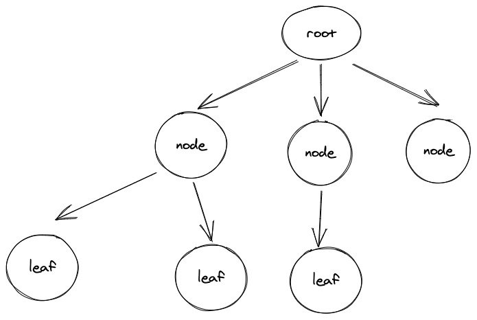
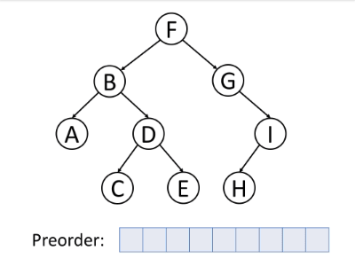
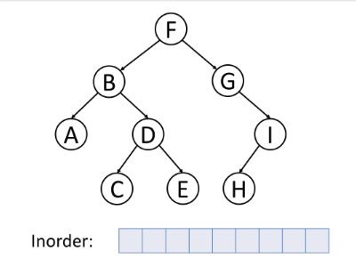
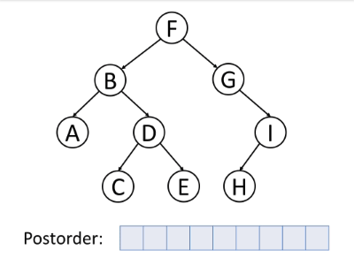
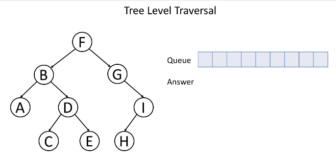
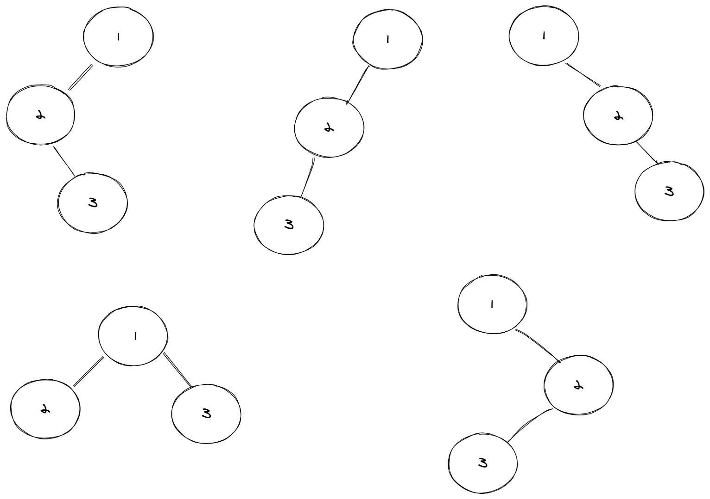

# 树

## 介绍

计算机的数据结构是对现实世界物体间关系的一种抽象。比如家族的族谱，公司架构中的人员组织关系，电脑中的文件夹结构，html 渲染的 dom 结构等等，这些有层次关系的结构在计算机领域都叫做树。

我们平时做题时候的树其实是一种逻辑结构。

## 基本概念

树是一种非线性数据结构。树结构的基本单位是节点。节点之间的链接，称为分支（branch）。节点与分支形成树状，结构的开端，称为根（root），或根结点。根节点之外的节点，称为子节点（child）。没有链接到其他子节点的节点，称为叶节点（leaf）。如下图是一个典型的树结构：



每个节点可以用以下数据结构来表示：

```c
Node {
	value: any; // 当前节点的值
	children: Array<Node>; // 指向其儿子
}
```

其他重要概念：

- 树的高度：节点到叶子节点的最大值就是其高度。
- 树的深度：高度和深度是相反的，高度是从下往上数，深度是从上往下。因此根节点的深度和叶子节点的高度是 0；
- 树的层：根开始定义，根为第一层，根的孩子为第二层。
- 二叉树，三叉树，。。。 N 叉树，由其子节点最多可以有几个决定，最多有 N 个就是 N 叉树。

## 二叉树

二叉树是树结构的一种，两个叉就是说每个节点最多只有两个子节点，我们习惯称之为左节点和右节点。

> 注意这个只是名字而已，并不是实际位置上的左右

二叉树也是我们做算法题最常见的一种树，因此我们花大篇幅介绍它，大家也要花大量时间重点掌握。

二叉树可以用以下数据结构表示：

```c
Node {
	value: any; // 当前节点的值
	left: Node | null; // 左儿子
	right: Node | null; // 右儿子
}
```

### 二叉树分类

- 完全二叉树
- 满二叉树
- 二叉搜索树
- [平衡二叉树](https://github.com/azl397985856/leetcode/blob/master/thinkings/balanced-tree.md)
- 红黑树
- 。。。

### 二叉树的表示

- 链表存储
- 数组存储。非常适合完全二叉树

### 二叉树遍历

二叉树的大部分题都围绕二叉树遍历展开，二叉树主要有以下遍历方式：

1. 前序遍历
2. 中序遍历
3. 后序遍历
4. 层序遍历(BFS)

> 你如果想锯齿遍历也可以， 不过除非特意考察你这个点，否则我们仅考虑以上的基本遍历方式

#### 前序遍历

- 前序遍历的顺序
  1. 访问当前节点
  2. 遍历左子树
  3. 遍历右子树

如下动图很好地演示了前序遍历算法的过程。



前序遍历的伪代码：

```py
preorder(root) {
	if not root: return
	doSomething(root)
	preorder(root.left)
	preorder(root.right)
}
```

#### 中序遍历

- 中序遍历的顺序
  1. 遍历左子树
  2. 访问当前节点
  3. 遍历右子树

如下动图很好地演示了中序遍历算法的过程。



中序遍历的伪代码：

```py
inorder(root) {
	if not root: return
	inorder(root.left)
	doSomething(root)
	inorder(root.right)
}

```

#### 后续遍历

- 后序遍历的顺序
  1. 遍历左子树
  2. 遍历右子树
  3. 访问当前节点

如下动图很好地演示了后序遍历算法的过程。



后序遍历的伪代码：

```py
postorder(root) {
	if not root: return
	postorder(root.left)
	postorder(root.right)
	dosomething(root)
```

#### 层序遍历(BFS)

层次遍历从直观上会先遍历树的第一层， 再遍历树的第二层，以此类推。

具体算法上，我们可是使用 DFS 并记录当前访问层级的方式实现， 不过更多的时候还是使用借助队列的先进先出的特性来实现。关于队列，我们已经在第一节的时候讲过了。

如下动图很好地演示了层次遍历算法的过程。



二叉树层次遍历伪代码：

```py
bfs(root) {
	queue = []
	queue.push(root)
	while queue.length {
		curLevel = queue
		queue = []
		for i = 0 to curLevel.length {
			doSomething(curLevel[i])
			if (curLevel[i].left) {
				queue.push(curLevel[i].left)
			}
			if (curLevel[i].right) {
				queue.push(curLevel[i].right)
			}
		}
	}
}
```

### 二叉树构建

二叉树有一个经典的题型就是构造二叉树。注意单前/中/后序遍历是无法确定一棵树，比如以下所有二叉树的前序遍历都为 123



但是中序序列和前、后，层次序列任意组合唯一确定一颗二叉树（前提是遍历是**基于引用**的或者二叉树的**值都不相同**）。

前、中，层次序列都是提供根结点的信息，中序序列用来区分左右子树。

实际上构造一棵树的本质是：

1. 确定根节点
2. 确定其左子树
3. 确定其右子树

比如拿到前序遍历结果 preorder 和中序遍历 inorder，在 preorder 我们可以能确定树根 root，拿到 root 可以将中序遍历切割中左右子树。这样就可以确定并构造一棵树，整个过程我们可以用递归完成。详情见 [构建二叉树专题](https://github.com/azl397985856/leetcode/blob/master/selected/construct-binary-tree.md)

### 二叉搜索树

二叉搜索树是二叉树的一种，具有以下性质

1. 左子树的所有节点值小于根的节点值（注意不含等号）
2. 右子树的所有节点值大于根的节点值（注意不含等号）

另外二叉搜索树的中序遍历结果是一个有序列表，这个性质很有用。比如 [1008. 前序遍历构造二叉搜索树](https://leetcode-cn.com/problems/construct-binary-search-tree-from-preorder-traversal/description/)。根据先序遍历构建对应的二叉搜索树，由于二叉树的中序遍历是一个有序列表，我们可以有以下思路

1. 对先序遍历结果排序，**排序结果是中序遍历结果**
2. 根据先序遍历和中序遍历确定一棵树

原问题就又转换为了上面我们讲的《二叉树构建》。

## 堆

在这里讲堆是因为堆可以被看作近似的完全二叉树。堆通常以数组形式的存储，而非上述的链式存储。

表示堆的数组 A 中，如果 A[1]为根节点，那么给定任意节点 i，其父子节点分别为

- 父亲节点：Math.floor(i / 2)
- 左子节点：2 \* i
- 右子节点: 2 \* i + 1

如果 A[parent(i)] ≥ A[i]，则称该堆为最大堆，如果 A[parent(i)] ≤ A[i]，称该堆为最小堆。

堆这个数据结构有很多应用，比如堆排序，TopK 问题，共享计算机系统的作业调度(优先队列)等。下面看下给定一个数据如何构建一个最大堆。

伪代码：

```c++
// 自底向上建堆
BUILD-MAX-HEAP(A)
	A.heap-size = A.length
	for i = Math.floor(A.length / 2) downto 1
		MAX-HEAPIFY(A, i)

// 维护最大堆的性质
MAX-HEAPIFY(A, i)
	l = LEFT(i)
	r = RIGHT(i)
	// 找到当前节点和左右儿子节点中最大的一个，并交换
	if l <= A.heap-size and A[l] > A[i]
		largest = l
	else largest = i
	if r <= A.heap-size and A[r] > A[largest]
		largest = r
	if largest != i
		exchange A[i] with A[largest]
		// 递归维护交换后的节点堆性质
		MAX-HEAPIFY(A, largest)
```

_ps: 伪代码参考自算法导论_

## 递归

### 简介

二叉树是一种递归的数据结构， 是最能体现递归美感的结构之一，看到二叉树的题第一反应就应该是用递归去写。

递归就是**方法或者函数调用自身的方式成为递归调用**。在这个过程中，调用称之为**递**，返回成为**归**。

算法中使用递归可以很简单地完成一些用循环实现的功能，比如二叉树的左中右序遍历。递归在算法中有非常广泛的使用，包括现在日趋流行的函数式编程。

有意义的递归算法会把问题分解成规模缩小的同类子问题，当子问题缩减到寻常的时候，就可以知道它的解。然后建立递归函数之间的联系即可解决原问题，这也是我们使用递归的意义。准确来说， 递归并不是算法，它是和迭代对应的一种编程方法。只不过，由于隐式地借助了函数调用栈，因此递归写起来更简单。

一个问题要使用递归来解决必须有递归终止条件（算法的有穷性）。虽然以下代码也是递归，但由于其无法结束，因此不是一个有效的算法：

```py
def f(n):
  return n + f(n - 1)
```

更多的情况应该是：

```py
def f(n):
  if n == 1: return 1
  return n + f(n - 1)
```

### 递归中的重复计算

递归中可能存在这么多的重复计算，为了消除这种重复计算，一种简单的方式就是记忆化递归。即一边递归一边使用“记录表”（比如哈希表或者数组）记录我们已经计算过的情况，当下次再次碰到的时候，如果之前已经计算了，那么直接返回即可，这样就避免了重复计算。而**动态规划中 DP 数组其实和这里“记录表”的作用是一样的**。

### 递归的时间复杂度分析

敬请期待我的新书。

### 练习递归

一个简单练习递归的方式是将你写的迭代全部改成递归形式。比如你写了一个程序，功能是“将一个字符串逆序输出”，那么使用迭代将其写出来会非常容易，那么你是否可以使用递归写出来呢？通过这样的练习，可以让你逐步适应使用递归来写程序。

如果你已经对递归比较熟悉了，那么我们继续往下看。

### 推荐题目

- 汉诺塔问题
- fibonacci 数列
- 二叉树的前中后序遍历
- 归并排序
- 求阶乘
- 递归求和

## 相关专题

- 二叉树的最大路径和
- 给出所有路径和等于给定值的路径
- 最近公共祖先
- 各种遍历。前中后，层次，拉链式等。
- [专题篇 - 搜索](./topic-search.md)
- [二叉树的遍历](https://github.com/azl397985856/leetcode/blob/master/thinkings/binary-tree-traversal.md)
- [前缀树专题](https://github.com/azl397985856/leetcode/blob/master/thinkings/trie.md)

## 题目推荐

- [589. N 叉树的前序遍历](https://leetcode-cn.com/problems/n-ary-tree-preorder-traversal/)（熟悉 N 叉树）
- [662. 二叉树最大宽度](https://leetcode-cn.com/problems/maximum-width-of-binary-tree/) (请分别使用 BFS 和 DFS 解决，空间复杂度尽可能低)
- [834. 树中距离之和](https://leetcode-cn.com/problems/sum-of-distances-in-tree/description/)（谷歌面试题）
- [967. 连续差相同的数字](https://leetcode-cn.com/problems/numbers-with-same-consecutive-differences/description/) (隐形树的遍历)
- [1145. 二叉树着色游戏](https://leetcode-cn.com/problems/binary-tree-coloring-game/)（树上进行决策）

## 总结

树是一种很重要的数据结构， 而我们研究树又以研究二叉树为主。

二叉树去掉一个子节点就是链表， 增加环就是图。它和很多数据结构和算法都有关联。因此掌握树以及树的各种算法就显得尤其重要。本章提到的内容都是经过我的筛选，去掉那些对刷题不那么重要的内容，因此这剩下的内容大家一定要熟练使用才行。

对于刷题来说，二叉树特别适合练习递归。一方面是其数据结构天生的递归性，另一方面树比链表这种递归数据结构复杂，树是非线性的，因此可以出的题相对比较多。

## 参考文献

- 图片参考自 [https://wylu.me/posts/e85d694a/](https://wylu.me/posts/e85d694a/)
- 《算法导论》