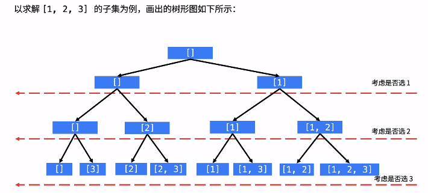

## [78. 子集](https://leetcode-cn.com/problems/subsets/)

### 思路1（回溯+DFS）

-   通过该数组`[1, 2, 3]`构建一棵树

-   刚开始什么都没有，接下来又两种选择，要么继续不添加，要么添加一个1
    -   如果是没添加的话，那么接下来又有两种选择，还是不添加，或者添加一个1
    -   如果已经添加了一个1，接下来还是有两种选择，不添加，或者添加2
    -   ......以此类推
    
-   什么时候**得到答案**呢？就是遍历到叶子节点的时候，就会有答案，所以`index == nums.length`时候结束递归

-   如图：

    

### 代码


```java
class Solution {
    List<List<Integer>> res = new ArrayList<>();

    public List<List<Integer>> subsets(int[] nums) {
        if (nums.length == 0) {
            return res;
        }

        // 临时的path路径集合
        LinkedList<Integer> path = new LinkedList<>();
        // 搜索
        dfs(nums, 0, path);
        return res;
    }

    public void dfs(int[] nums, int index, LinkedList<Integer> path) {
        // 到达底端就说明找到了最终path
        if (index == nums.length) {
            res.add(new ArrayList(path));
            return;
        }

        // 第一种情况：不选择任何元素
        dfs(nums, index+1, path);

        // 第二种情况：选择一个元素添加进path中，然后进入递归，最后还要将添加的删除
        path.add(nums[index]);
        dfs(nums, index+1, path);
        path.removeLast();
    }
}
```

### **复杂度分析**

- 时间复杂度：$O(N·2^N)$，其中 N 为数组长度
- 空间复杂度：$O(N)$，临时数组的空间是N

### 思路2（位运算）

-   总的子集个数为$2^n$，例题是3个元素，所以有8种不同的组合结果
-   然而这8种可能，我们又可以用3位二进制数来表示`000 001 010 011 100 101 110 111`，很简单，0就是代表不包含元素，1就是代表包含元素。
-   例如`101`意思就是子集为`[1, 3]`，`110`意思就是子集为`[1, 2]`，正好所有的结果都被表示出来了
-   那么怎么解题呢，即然结果是8个，那么就从0遍历到7，每次遍历再对这个数字进行核验，将为1的位置的那个元素添加道temp中，核验完成之后将temp就得到一个子集，我们将子集添加到res即可

### 代码


```java
class Solution {
    public List<List<Integer>> subsets(int[] nums) {
        List<List<Integer>> res = new ArrayList<>();
        int len = nums.length;

        for (int i = 0; i < 1 << len; i++) {
            List<Integer> temp = new ArrayList<>();
            for (int j = 0; j <= len; j++) {
                if ((i & (1 << j)) != 0) {
                    temp.add(nums[j]);
                }
            }
            res.add(temp);
        }
        
        return res;
    }
}
```

### **复杂度分析**

- 时间复杂度：$O(N·2^N)$，其中 N 为数组长度
- 空间复杂度：$O(N)$，临时数组的空间是N