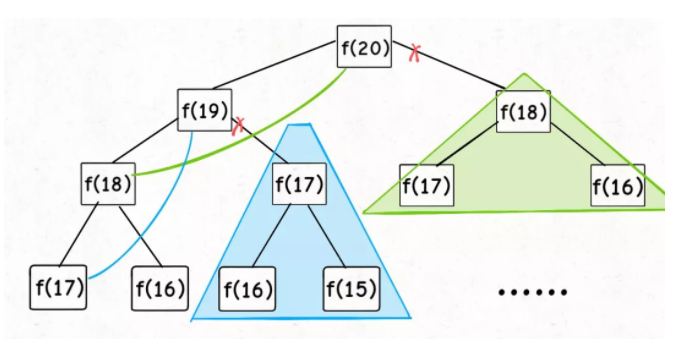
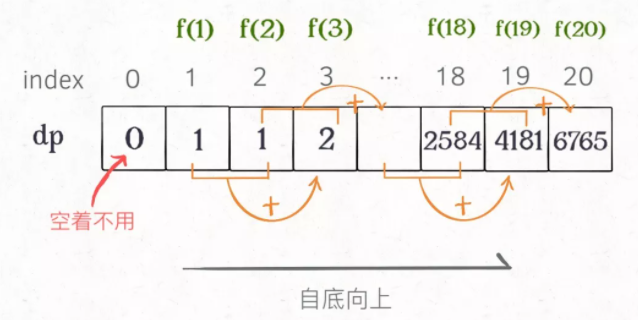

## [70. 爬楼梯](https://leetcode-cn.com/problems/climbing-stairs/)

### 思路1（数学公式）

-   利用斐波那契数列的公式即可

### 代码


```java
class Solution {
    public int climbStairs(int n) {
        double sqrt_5 = Math.sqrt(5);
        double fib_n = Math.pow((1+sqrt_5) / 2, n+1) - Math.pow((1-sqrt_5) / 2, n+1);
        return (int)(fib_n / sqrt_5);
    }
}
```

### **复杂度分析**

- 时间复杂度：$O(logN)$，`pow` 方法将会用去 O(logN) 的时间
- 空间复杂度：$O(1)$

### 思路2（带备忘录的递归）

-   如果直接暴力递归的话，通过不了

-   到达第n层的方法数是第`n-1`层的路径加上`n-2`层路**（自顶向下）**

-   因此我们构建一个树，但是会发现这个树中有很多地方都重复了，明明已经计算过了一遍却还要再计算一遍，所以我们可以用一个备忘录把计算过的存储道备忘录中，再次遇到时，返回这个数即可

    

### 代码


```java
class Solution {
    public int climbStairs(int n) {
        double sqrt_5 = Math.sqrt(5);
        double fib_n = Math.pow((1+sqrt_5) / 2, n+1) - Math.pow((1-sqrt_5) / 2, n+1);
        return (int)(fib_n / sqrt_5);
    }
}
```

### **复杂度分析**

- 时间复杂度：$O(N)$，其中 N 为数组长度
- 空间复杂度：$O(N)$，其中 N 为数组长度

### 思路3（动态规划）

-   使用动态规划，**自底向上**的思想

-   刚开始用的是一维数组，即DP表，可以得到状态转移方程`F(N) = F(N-1) + F(N-2)`。

-   把 F(n) 想做一个状态 n，这个状态 n 是由状态 n - 1 和状态 n - 2 相加转移而来，这就叫状态转移

    

-   根据斐波那契数列的状态转移方程，我们可以知道，当前的状态只和 n-1 和 n-2 有关，因此我们仅仅需要存储前两个变量，那么当前的结果就出来了，所以，空间复杂度可以优化道$O(1)$

### 代码


```java
/* 用一维数组的DP
class Solution {
    public int climbStairs(int n) {
        int[] dp = new int[50];
        dp[1] = 1;
        dp[2] = 2;

        for (int i = 3; i <= n; i++) {
            dp[i] = dp[i-1] + dp[i-2];
        }
        return dp[n];
    }
}
*/

class Solution {
    public int climbStairs(int n) {
        int p = 0;
        int q = 0;
        int r = 1;
        for (int i = 0; i < n; i++) {
            p = q;
            q = r;
            r = p + q;
        }
        return r;
    }
}
```

### **复杂度分析**

- 时间复杂度：$O(N)$，其中 N 为数组长度
- 空间复杂度：$O(1)$

<hr>

## [62. 不同路径](https://leetcode-cn.com/problems/unique-paths/)

TODO

<hr>

## [121. 买卖股票的最佳时机](https://leetcode-cn.com/problems/best-time-to-buy-and-sell-stock/)

TODO

<hr>

## [122. 买卖股票的最佳时机 II](https://leetcode-cn.com/problems/best-time-to-buy-and-sell-stock-ii/)

TODO

<hr>

## [123. 买卖股票的最佳时机 III](https://leetcode-cn.com/problems/best-time-to-buy-and-sell-stock-iii/)

TODO

<hr>

## [188. 买卖股票的最佳时机 IV](https://leetcode-cn.com/problems/best-time-to-buy-and-sell-stock-iv/)

TODO

<hr>

## [309. 最佳买卖股票时机含冷冻期](https://leetcode-cn.com/problems/best-time-to-buy-and-sell-stock-with-cooldown/)

TODO

<hr>

## [714. 买卖股票的最佳时机含手续费](https://leetcode-cn.com/problems/best-time-to-buy-and-sell-stock-with-transaction-fee/)

TODO